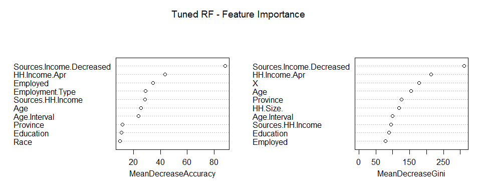
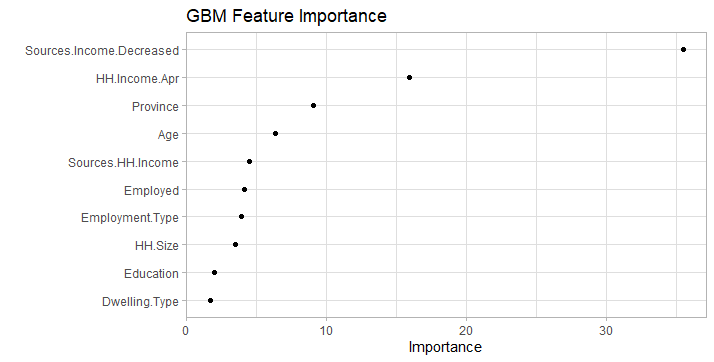
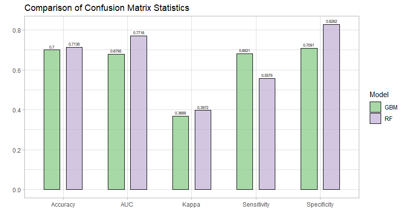
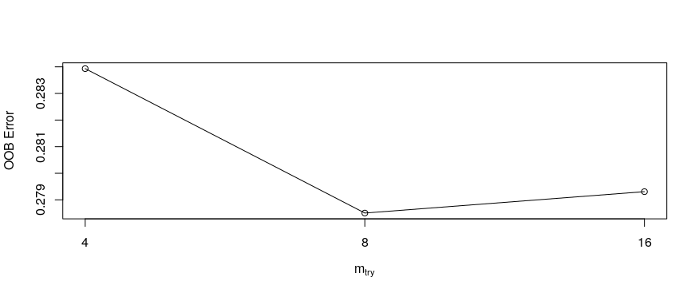
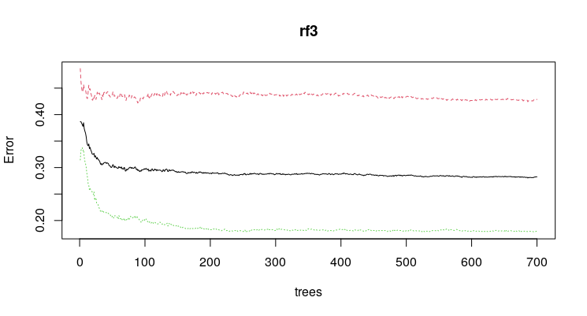
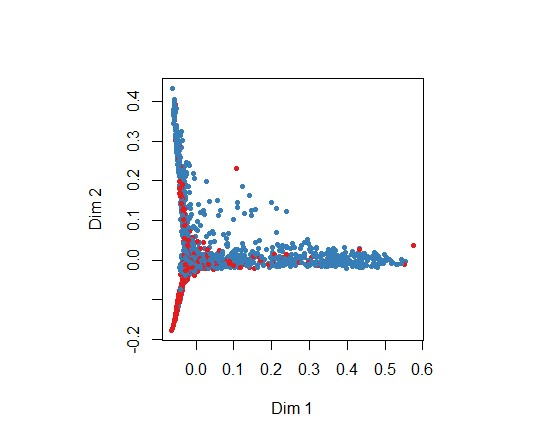
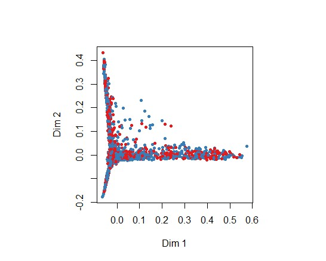
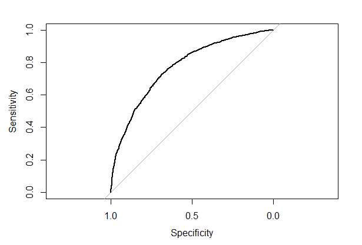
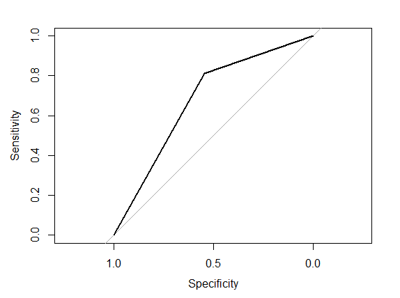

```{r setup, include=FALSE}
knitr::opts_chunk$set(echo = FALSE, message = FALSE, warning = FALSE, fig.width = 6, fig.height = 5, fig.pos="H", fig.pos = 'H')
# Note: Include = FALSE implies the code is executed, but not printed in your pdf.
# warning and message = FALSE implies ugly messages and warnings are removed from your pdf.
# These should be picked up when you execute the command chunks (code sections below) in your rmd, not printed in your paper!
library(tidyverse)

```


<!-- ############################## -->
<!-- # Start Writing here: -->
<!-- ############################## -->

# Introduction \label{Introduction}

The purpose of this paper is to report on the implementation of two machine-learning (ML) algorithms for a classification-type problem. South Africa, like most countries, have undergone severe economic pressures due to the Covid-19 pandemic and the ensuing hard lockdown. Many individuals and households have reported that they have lost their primary source of income due to the latter. This study employs two different tree-based ML algorithms to help identify who was most likely to lose their primary source of income given a variety of other variables. These two algorithms are 1) a baseline tuned Random Forest (RF), and 2) a simple Gradient-Boosted Model (GBM). This report therefore compares the accuracy of these algorithms in classifying which households were more likely to lose their main source of income due to the coronavirus and subsequent lockdown in South Africa in March and April 2020.^[The template for this report is based on that provided by @Texevier.] 

# Data  \label{Data}

This study utilises the first wave of the National Income Dynamics Study - Coronavirus Rapid Mobile Survey 2020 (NIDS-CRAM) dataset, a nationally representative longitudinal household survey conducted over telephone by the Southern Africa Labour and Development Research Unit (SALDRU) in April and May 2020. NIDS-CRAM investigates the various social and economic effects of the national lockdown implemented in March 2020, and more broadly, the consequences of the global pandemic on the South African population @nids2020.^[Data is publicly available at https://www.datafirst.uct.ac.za/.]

For our analysis, however, a subsample of the NIDS-CRAM dataset was collected. Emphasis was placed on the first wave, as this would be where the effects of lockdown would be felt most acutely in terms of loss of income sources. This is preferable as one wants to build a model that most accurately classifies between the pre-pandemic and post-lockdown states. The final dataset consists of 21 features, reported in Table \ref{Features} below, with 7073 observations in total. Table \ref{Features} also reports the amount of missing values for each feature, as well as a relevant description.^[ In this case, the survey answers 'Refused', 'Don't Know', 'Not Applicable' and 'Missing' are all defined as NAs.] The main feature of interest is 'Income Change' - a binary variable where a value of 1 indicates that the household has lost their main source of income, whilst 2 indicates that it has not. The question asked to respondents reads as follows: "Has your household lost its main source of income since the lockdown started on 27th March?". 

\begin{table}
\begin{center}
\begin{tabular}{ |l|c|l| } 
 \hline
 Selected Features & NAs & Description \\ 
 \hline
  Income Change & 168 &  Has household lost main source of income since lockdown \\ 
  Sources Income Decreased & 376 & Did sources of household income decrease during lockdown \\
  Employed & 161 &  Employment Status \\
  Employment Type & 151 & Respondent's main form of work (0 = unemployed) \\
  Sources HH Income & 121 & Sources of household income in February \\
  Children Change & 93 & Change in number of children in house compared to pre-lockdown \\
  Province & 8 & Province currently living in now \\
  Dwelling Type & 6 & Type of dwelling, whether house, informal, traditional or other \\
  Race & 0 & Respondent's given population group \\
  Geo Type & 8 & Geography Type (derived from 2011 census) \\
  HH Income Apr & 2665 & Total household income after tax in April \\
  Moved & 8 & Whether respondent moved to another dwelling for lockdown \\
  Grant & 36 & Whether the respondent receives any kind of government grant \\
  Electricity Access & 2 & Whether dwelling has access to electricity \\
  Water Access & 5 & Whether dwelling has piped or tap water \\
  HH Size & 32 & Number of people resident (Household Size) \\
  Education & 45 & Highest school grade completed \\
  Tertiary & 9 & Has respondent successfully completed some tertiary education \\
  Age & 0 & Respondent's age in years \\
  Age Interval & 0 & Age interval (5 year intervals) \\
  Gender & 0 & Respondent's stated gender \\
  District Council & 8 & Municipal Demarcations Board District Council (from 2011 Census) \\
  \hline
\end{tabular}
\caption{Features}
\label{Features}
\end{center}
\end{table}

## Missing Values and Transformations {-}

It is evident from \ref{Features} that missing values might be a stumbling block for accurate analysis. In particular, the 'HH Income Apr' variable has a large amount of NAs, most of which are attributed to the 'Don't Know' category on the questionnaire. In other words, respondents reported that they did not know their exact level of income for the month of April 2020. In order to avoid losing potentially valuable information, this study imputes missing values for all features within the dataset. Furthermore, NAs for the 'Employment Type' feature are replaced by 0's to indicate 'unemployed', as this survey question was only asked to those who were employed. Those who refused to respond or did not know their main form of work, were indicated as missing and therefore imputed. Similarly, system NAs for the 'Tertiary' feature - a dummy variable indicating whether an individual completed some form of tertiary education - was replaced by 0, or 'no', as this question was only asked to those who were eligible. Although not perfect solutions, these are fair assumptions to make in order to include these potentially meaningful variables. Additionally, the feature indicating in which District Council the household is situated was transformed into a matrix of binary variables so as to accommodate the necessary structure needed for imputation.^[This is due to the fact that only 53 levels are allowed for factored variables using both the *missForest* and *randomForest* packages, whereas the District Council variable consists of 54 levels.]

Methodologically, a random forest algorithm - trained on the matrix of observed values in the data - is used to impute missing values. This can be done using the package *missForest* in R, which follows a two-step procedure. First, missing values are pre-imputed using simple median replacement for continuous data types - where the missing value is replaced with the median value computed on the rest of the observed data for each continuous feature. For categorical variables, missing values are replaced by  the most frequently occurring non-missing value.^[This replacement-procedure is also called Strawman imputation.] Second, a forest is grown using multivariate splitting, where the splitting rule is averaged only over non-missing values. Data is then imputed by regressing each feature on all other features, thereafter predicting missing values using the fitted forest. This process is iterated in order to update the initial median-replaced values until the stopping criterion - in our case, when the difference between the previous iteration and new iteration have become larger once for each data type - is met [@tang2017random]. 

The usage of this specific algorithm is necessitated by the nature of the data, where features are of three different data types, categorical, numeric and continuous. @stekhoven2012missforest and @tang2017random show that this iterative RF imputation procedure outperforms many other widely-used implementation methods such as, for instance, K-Nearest Neighbours (KNN) and Multivariate Imputation by Chained Equations (MICE), especially within mixed-type data contexts. Furthermore, it inherits all the useful characteristics attributed to random forests itself, such as being robust to noisy data due to inherent feature selection, as well as being simple to implement. However, it is computationally intensive, and crucially also relies on the assumption that missing data are Missing At Random (MAR). If not MAR, there is possibility of introduced selection bias.^[ *missForest* is not unique in requiring this assumption, however.] This is deemed a permissible admission due to the relatively low number of missing values in the dataset as a whole. For the most problematic feature, 'HH Income Apr', the imputation strategy above, specifically Strawman imputation, is especially relevant as missing values are more likely to be those closer to the median-income group than to, for instance, the mode or mean income due to the distribution of income in South Africa. 

#  Methodology \label{Meth}

## Computation {-}

All computation was done using the Amazon Web Services' (AWS) Elastic Compute Cloud (EC2) service, combined with the functionality of RStudio Server. A 'c5.2xlarge' virtual machine instance was created with a public IP address, through which RStudio Server was initiated. This instance has 8 vCPUs and 16 GiB of memory. Cloud computing is necessitated due to computing limitations on the local machine, however, clustering was not deemed necessary due to the relatively small size of the data. Regardless, the additional CPUs and faster processing that the VM instance provides allow for parallel programming, which was utilised for the more computationally intensive tasks such as missing value imputation and parameter tuning (using the Parallel sockets approach, made available through packages such as *doParallel* and *doRNG*).

## SQL {-}

SQL was used in two ways in this study. First, *sqlite3* databases were created for the separate tables entitled 'nids' and 'derived', and subsequently compiled in one large database containing all features of the raw data. This was done using SQL syntax and the function *dbConnect* within RStudio. However, using the Bash Unix shell for Windows^[Made accessible due to being a member of the Windows Insider Program.], these tables were queried and data was surveyed in order to select the relevant features necessary for model implementation. Although not necessary to use SQL to this end, it is more efficient in terms of memory usage than reading the larger datasets directly into R's memory. After feature selection, the final dataset to be read into R was once again compiled and collected within RStudio using SQL syntax.

## Models {-}

This study compares the performance of three different classification algorithms: 1) a random forest and 2) a simple GBM. Both are tree-based ensemble algorithms, but with distinct differences. Where RFs build an ensemble of 'deep', independent trees, GBMs build an ensemble of 'shallow' trees - where each tree subsequently learns from and improves upon the previous one. These shallow trees, themselves fairly weak predictors, can then be boosted to improve predictive performance by incorporating gradient descent to minimise some loss function [@boehmke].^[ The technical details underlying these algorithms will not be discussed here. For a more in-depth discussion, refer to @boehmke.] The outcome feature of interest, 'Income.Change', is a binary variable, thus making classification-type models more appropriate. For all three models, the data being used is the full imputed dataset of 7073 observations for 21 features and one outcome variable. The data is randomly partitioned into training and test samples according to a 70/30 split. Model performance is measured according to confusion matrix results and related statistics. Specifically, models are compared with respect to their the Out of Bag (OOB) error (in the case of RF), accuracy, Cohen's Kappa, Sensitivity and Specificity and Area Under Curve (AUC) scores.^[Cohen’s kappa is a useful metric for gauging classification accuracy in unbalanced data sets such as the one analysed here.]

For the RF implementation, two models are computed. The first is a baseline model with 500 trees, 4 features randomly sampled as candidates at each split, sampling without replacement and default values for tree complexity and node size. Thereafter, these hyperparameters were tuned to find optimal values that minimise OOB error estimates. An additional RF model - now using the optimised hyperparameter values - was then fit. 

The second algorithm, a simple GBM, uses decision trees as a base learner from which to boost classification performance. The simple GBM was built using the data imputed in the previous section, trained on the same training set and tested on the test set. A hyper-parameter grid-search was employed to find the optimal hyperparameters with which to train the GBM, and was tested on a control, or validation, subsample that resampled the training dataset using 10 cross-validations folds. In the case of a simple GBM, there are four primary parameters: 1) number of trees, 2) interaction depth, 3) shrinkage, or learning rate, and 4) the minimum number of observations at terminal nodes. The performed grid search reported optimal values for these four parameters as follows: trees = 300, interaction depth = 5, shrinkage = 0.05, and 11 minimum observations at terminal nodes. These parameter values were then used to estimate the GBM using the *gbm* package. As the outcome variable is binary, a Bernoulli distribution and its relevant loss function, logistic regression for 0-1 outcomes, was chosen. 

# Results

## Model 1: Random Forest

The first model implemented is a simple untuned RF, where hyperparameters are initially set to 500 trees, *mtry* equal to 4, a node size of 1 (the default for classification), and sampling being done without replacement. The model performs decently on the training data, classifying whether households lost their main form of income with 87.33% accuracy and a Kappa of 0.7325. However, accuracy drops to nearly 70% on the test data, while the kappa value decreases to 0.3733. This indicates model overfitting before tuning parameters. Overall, the OOB error rate reads as 29.02% for this untuned model. After tuning *mtry* and choosing the optimal number of trees, the new RF model displays slightly better results. The OOB error now reads as 28.25%, with training accuracy increasing to 99.64% and the kappa value also improving considerably to 0.9925. These gains do not translate when applied to the test data, however, as accuracy increases by 1.3 percentage points, to 71.38%, and the kappa value to 0.3972. The large difference between test and training model accuracy indicates overfitting once again. Model results, and the related Specificity, Sensitivity and Area Under Curve (AUC) scores are displayed below, in figure \ref{comparison}. Furthermore, tuning results are displayed in appendix \ref{rfappendix}, along with Multi-Dimensional Scaling (MDS) plots for the trained and test results. MDS plots are a visualisation of the scaling coordinates of the fitted model's proximity matrix.

Figure \ref{varimprf1} below shows which features are most important in the classification process. Intuitively, it makes sense that the variable indicating whether the sources of household income decreased during lockdown would be important. It is also clear that household level of income is important, as is employment status and the sources of income, be it from transfers, employment or other means. Similarly, age and province are also influential. 

```{r varimprf1,fig.cap="\\label{varimprf1} RF Feature Importance", echo = FALSE, message = FALSE, warning = FALSE, out.width="100%", fig.height = 5, fig.pos="H"}



```

## Model 2: GBM 

The GBM model reports a classification accuracy of 0.70, which is slightly lower than that achieved by the RF model. In fact, it performs worse in every metric, except for sensitivity - the number of correct positive predictions divided by the total number of positives. Figure \ref{comparison} gives a full overview of the comparison between the two models, while Figure \ref{gbm_impplot} below reports the feature importance plot for the GBM.

```{r gbm_impplot,fig.cap="\\label{gbm_impplot} GBM Feature Importance", echo = FALSE, message = FALSE, warning = FALSE, out.width="100%", fig.height = 5, fig.pos="H"}



```

## Comparison

As seen in Figures \ref{varimprf1} and \ref{gbm_impplot}, both the RF model and the GBM model largely identify the same 10 features as being the most important in classifying income change, however, with differences in ordering. Province and Age seem to be more important in the GBM model, whilst employment status and type are more crucial in the RF model. Whether any source of income decreased and total household income, however, are the most important features throughout. In terms of classification accuracy, Figure \ref{comparison} below compares the two models in terms of some of the most important statistics derived from the respective confusion matrices. It is clear that the RF algorithm outperforms the GBM algorithm for most metrics, the most important of which is Accuracy, which gives and indication of the ratio of correct predictions to total predictions. Likewise, both the RF and GBM models have low Cohen's kappa values, indicating lower classification performance in the case of imbalanced data. Lastly, both models are better at correctly classifying negative cases - specificity (those who did not lose their main source of income post-lockdown) - compared to positive cases - sensitivity (those who lost their main source of income).^[This can be seen in the Appendix \ref{roc} when comparing the ROC curves, as well.] Ideally, one would prefer to be able to more accurately classify the latter group compared to the former, as it is more useful for policy-makers to protect groups that are more at risk of losing their main income source.

```{r comparison,fig.cap="\\label{comparison} Comparison", echo = FALSE, message = FALSE, warning = FALSE, out.width="100%", fig.height = 5, fig.pos="H"}



```

Although these results are not ideal, it is clear that they could perhaps form the baseline for a deeper classification study. For instance, one could attempt to lower overfitting in the RF model, or drop some of the features in order to cross-validate results. One could also train a XGBoost model in order to increase classification performance, or attempt to repeat this process on a different dataset with a similar outcome variable. These additions, although not included in the current report due to time and resource constraints, leave considerable scope for further model improvements and robustness checks.

# Conclusion

This report attempted to compare two models - a Random Forest and simple Gradient-Boosted Model - on their performance in classifying which individuals would lose their main source of income given the South African Covid-19-induced lockdown. Models were trained on subsamples of NIDS-CRAM data and tested on testing subsamples, where missing values were imputed using random forest methods. Model results indicate relative accuracy, around 70% for both models. However, the RF outperforms the GBM in most confusion matrix statistics. Lastly, as expected, some of the most important features for classification are household income, employment status and type, province of residence and age. There remains much scope for additional tuning and model performance enhancement in the future, as well as the possibility of additional studies that utilise these methods and data in order to answer varying classification-type problems. This is especially useful in the times of Covid-19, where accurate machine learning algorithms could help address the problematic socioeconomic aspects of lockdown. 

\newpage

# References {-}

<div id="refs"></div>

\newpage

# Appendix \label{Appendix} {-}
## RF Plots \label{rfappendix} {-}

```{r tune, fig.cap="\\label{tune} Mtry tuning Plot", fig.show='hold', echo = FALSE, fig.align='center', message = FALSE, warning = FALSE, out.width= "80%", out.height="30%", fig.pos="H"}



```

```{r rferror, fig.cap="\\label{rferror} Error Plot", fig.show='hold', echo = FALSE, fig.align='center', message = FALSE, warning = FALSE, out.width= "80%", out.height="30%", fig.pos="H"}



```

```{r MDSrf3, fig.cap="\\label{MDSrf3} Multi-dimensional Scaling plots - Training Data (Top), Test Data (Bottom)", fig.show='hold', echo = FALSE, fig.align='center', message = FALSE, warning = FALSE, out.width= "100%", out.height="35%", fig.pos="H"}




```

## ROC Curves \label{roc} {-}

```{r rf3_roc, fig.cap="\\label{rf3_roc} ROC curves - RF (left), GBM (right)", fig.show='hold', echo = FALSE, fig.align='center', message = FALSE, warning = FALSE, out.width= "49%", out.height="30%", fig.pos="H"}




```


